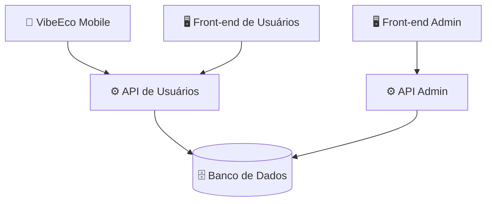

# 📚 VibeEco-Docs

<p align="center">
  <strong>Repositório de Documentação do VibeEco</strong><br>
  Plataforma Digital de Conscientização e Engajamento em Sustentabilidade
</p>

<p align="center">
  
</p>

---

## 📌 Sobre este Repositório

Este repositório reúne toda a **documentação do projeto VibeEco**, desenvolvido pela **TechProton**.

Aqui ficam os documentos de requisitos, planejamento, modelagem, protótipos, arquitetura, APIs e testes, servindo como referência para todas as áreas da equipe: Banco de Dados, Back-end, Front-end e Mobile.

---

## 🧭 Navegação Rápida

| Documento | Descrição | Pasta |
|-----------|-----------|-------|
| 📋 Levantamento de Requisitos | Requisitos funcionais, não funcionais e de negócio | [`1-Requisitos`](./1-requisitos) |
| 🖼️ Protótipos | Protótipos Desktop, Mobile e Administrativo | [`2-Protótipos`](./2-prototipos) |
| ⚙️ APIs | Documentação das APIs de Usuários e Administrativa | [`3-Apis`](./3-apis) |
| 🗓️ WBS | EAP/WBS e cronograma | [`4-WBS`](./4-WBS) |
| 🧪 Testes | Planos e roteiros de testes | [`05-Roteiro de testes`](./5-Roteiro-de-testes) |

---

## 📁 Estrutura do Repositório

```text
VibeEco-Docs
│
├── 📁 01-requisitos
│   └── VibeEco_RF_RNF_RN.pdf
│
├── 📁 02-planejamento
│   ├── EAP-WBS
│   └── Cronograma
│
├── 📁 03-modelagem
│   ├── Modelo Conceitual
│   ├── Modelo Lógico
│   └── Modelo Físico
│
├── 📁 04-prototipos
│   ├── Desktop
│   ├── Mobile
│   └── Administrativo
│
├── 📁 05-arquitetura
│   └── Arquitetura do Sistema
│
├── 📁 06-apis
│   ├── API de Usuários
│   └── API Administrativa
│
├── 📁 07-testes
│   ├── PLANO_DE_TESTE_VibeEco_-_ROTEIRO.docx
│   ├── PLANO_DE_TESTE_VibeEco_-_DESEMPENHO.docx
│   └── PLANO_DE_TESTE_VibeEco_-_USABILIDADE.docx
│
└── 📄 README.md
```

---

## 📋 Requisitos

O documento de levantamento de requisitos define o escopo do VibeEco e está dividido em três grupos.

### Requisitos Funcionais (RF)

| Código | Requisito |
|--------|-----------|
| RF-001 | Login |
| RF-002 | Perfil de usuário |
| RF-003 | Feed |
| RF-004 | Missões |
| RF-005 | Conteúdos educativos |
| RF-006 | Gamificação |
| RF-007 | Ranking |
| RF-008 | Desafios |
| RF-009 | Notificações |
| RF-010 | Interação social |
| RF-011 | Histórico de atividades |
| RF-012 | Recompensas |
| RF-013 | Gerenciamento de usuários |
| RF-014 | Gerenciamento de missões |
| RF-015 | Gerenciamento de conteúdos |
| RF-016 | Monitoramento |

### Requisitos Não Funcionais (RNF)

O **RNF-001** reúne os requisitos gerais da plataforma:

- Bom desempenho;
- Segurança adequada para sistemas Web;
- Interface simples e intuitiva;
- Layout responsivo (computadores, tablets e celulares);
- Boas práticas de acessibilidade;
- Facilidade de manutenção e atualização;
- Infraestrutura capaz de suportar o crescimento de usuários e instituições;
- Padronização conforme a identidade visual do VibeEco;
- Compatibilidade com os principais navegadores e dispositivos.

### Requisitos de Negócio (RN)

| Código | Requisito |
|--------|-----------|
| RN-001 | Conscientização |
| RN-002 | Engajamento |
| RN-003 | Gamificação |
| RN-004 | Flexibilidade |
| RN-005 | Monitoramento |
| RN-006 | Reconhecimento |
| RN-007 | Expansão |

📄 **Documento completo:** [`01-requisitos/VibeEco_RF_RNF_RN.pdf`](./01-requisitos/VibeEco_RF_RNF_RN.pdf)

---

## 🗓️ Planejamento

- **EAP/WBS:** <https://miro.com/app/board/uXjVHoWnbAk=/>
- **Cronograma:** acompanhamento das etapas e entregas do projeto.

Início do projeto: **10/08/2026**.

---

## 🗄️ Modelagem do Banco de Dados

A modelagem segue as etapas:

```text
Modelo Conceitual → Modelo Lógico → Modelo Físico → Implementação → Validação
```

O banco de dados é implementado no repositório [VibeEco-DataBase](https://github.com/pedsousa06-ai/VibeEco-DataBase).

---

## 🖼️ Protótipos

Protótipos de alta fidelidade desenvolvidos para as diferentes plataformas:

- 🖥️ **Desktop:** interfaces destinadas aos usuários em computadores;
- 📱 **Mobile:** interfaces destinadas ao aplicativo Mobile;
- 🧑‍💼 **Administrativo:** interfaces destinadas aos administradores.

Os protótipos servem como referência visual para o desenvolvimento das interfaces.

---

## 🏗️ Arquitetura

O **Mobile** e o **Front-end de Usuários** consomem a **API de Usuários**, enquanto o **Front-end Administrativo** consome a **API Admin**. Ambas as APIs acessam o mesmo banco de dados.



---

## 🧪 Testes

Os planos de testes seguem o modelo **Plano de Teste de Software (Roteiro de Testes)** adotado no projeto. Cada caso de teste possui prioridade, requisito relacionado, tipo de teste, objetivo, motivação e uma tabela de passos com o resultado esperado.

| Plano | Foco | Casos de teste |
|-------|------|----------------|
| 🧩 **Roteiro de Funcionalidade** | RF-001 a RF-016 em Desktop e Mobile, usuário e administrador | 76 |
| ⚡ **Desempenho** | Tempo de resposta, carga, estresse, estabilidade e rede móvel | 15 |
| 🎯 **Usabilidade e Acessibilidade** | Tarefas sem auxílio, clareza da interface, acessibilidade, responsividade e satisfação | 18 |

### Organização do Roteiro de Funcionalidade

| Módulo | Escopo |
|--------|--------|
| 1 | Plataforma do Usuário — Desktop |
| 2 | Painel do Administrador — Desktop |
| 3 | Plataforma do Usuário — Mobile |
| 4 | Painel do Administrador — Mobile |

### Observações

- Os testes de **desempenho** e **usabilidade** estão relacionados ao **RNF-001**.
- Os valores de referência dos testes de desempenho (tempos de resposta, quantidade de usuários simultâneos e taxa de erros) são sugestões e devem ser validados pela equipe.
- Os testes de carga e estresse exigem uma ferramenta específica (por exemplo, JMeter ou k6).
- Os testes de acessibilidade utilizam ferramentas como leitor de tela (NVDA) e verificador de contraste.

---

## 🔗 Repositórios do Projeto

| Área | Repositório | Responsável |
|------|-------------|-------------|
| 🗄️ Banco de Dados | [VibeEco-DataBase](https://github.com/pedsousa06-ai/VibeEco-DataBase) | Ryller Feitosa |
| ⚙️ Back-end Usuários | [VibeEco-Back-End-Users](https://github.com/pedsousa06-ai/VibeEco-Back-End-Users) | Lucas Kolle |
| ⚙️ Back-end Administrativo | [VibeEco-Back-End-Adm](https://github.com/pedsousa06-ai/VibeEco-Back-End-Adm) | Lucas Kolle |
| 🖥️ Front-end Usuários | [VibeEco-Front-End-Users](https://github.com/pedsousa06-ai/VibeEco-Front-End-Users) | Gabriel Sousa |
| 🖥️ Front-end Administrativo | [VibeEco-Front-End-Adm](https://github.com/pedsousa06-ai/VibeEco-Front-End-Adm) | Gabriel Sousa |
| 📱 Mobile | [VibeEco-Mobile](https://github.com/pedsousa06-ai/VibeEco-Mobile) | Pedro Sousa |
| 📚 Documentação | [VibeEco-Docs](https://github.com/pedsousa06-ai/VibeEco-Docs) | Pedro Sousa |

---

## 📊 Status da Documentação

- [x] Levantamento de requisitos (RF, RNF e RN)
- [x] Roteiro de testes de funcionalidade
- [x] Roteiro de testes de desempenho
- [x] Roteiro de testes de usabilidade
- [ ] EAP/WBS
- [ ] Cronograma final
- [ ] Modelo conceitual
- [ ] Modelo lógico
- [ ] Modelo físico
- [ ] Protótipo Desktop
- [ ] Protótipo Mobile
- [ ] Protótipo Administrativo
- [ ] Documentação da API de Usuários
- [ ] Documentação da API Administrativa
- [ ] Arquitetura do sistema

---

## 🤝 Como Contribuir com a Documentação

1. Salve cada documento na pasta correspondente à sua categoria;
2. Mantenha o padrão de nomes dos arquivos (`TIPO_VibeEco_-_DESCRIÇÃO`);
3. Atualize o campo **Revisão** e a **Data** no cabeçalho dos documentos a cada alteração;
4. Atualize o **Status da Documentação** neste README ao concluir um documento;
5. Avise a equipe sobre mudanças que afetem requisitos, APIs ou modelagem.

---

## 👨‍💻 TechProton

| | |
|---|---|
| **Projeto** | VibeEco |
| **Empresa** | TechProton |
| **Categoria** | Tecnologia • Sustentabilidade • Educação |
| **Responsável pela documentação** | Pedro Sousa |
| **Status** | Em desenvolvimento |
| **Início** | 10/08/2026 |
